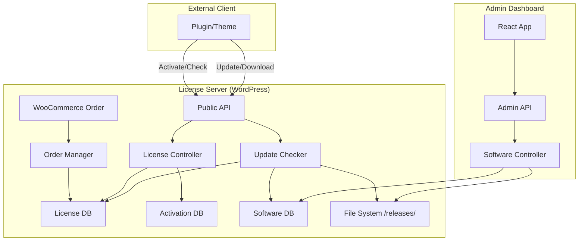

License Server is designed as a high-performance licensing backend that bridges WooCommerce commerce logic with a specialized REST API for software delivery.

## System Overview

The system consists of three primary domains:
1.  **Commerce (WooCommerce)**: Handles payments, order fulfillment, and license generation.
2.  **Operations (Admin API & SPA)**: Provides the interface for managing software, licenses, and releases.
3.  **Delivery (Public API)**: Serves activation, validation, and update requests to external clients.

---

## Data Flow Diagram

---

## Core Components

### 1. Orchestration (`Plugin.php`)
The `Plugin` class acts as the central hub. It initializes all controllers, managers, and services. It uses a singleton-like pattern to ensure that core services (like logging and database management) are shared across the application.

### 2. REST API Layer (`app/Api/`)
Endpoints are split into two namespaces:
-   **Admin Endpoints**: Require `manage_licenseserver` capability. Used by the React SPA to manage the system.
-   **Public Endpoints**: Do not require WordPress authentication. Security is instead enforced via:
    -   License key validation.
    -   Domain locking.
    -   IP-based rate limiting.

### 3. Database Layer (`app/Data/`)
License Server uses custom SQL tables for performance and isolation from standard WordPress post meta:
-   `wp_licenseserver_software`: Metadata about releases.
-   `wp_licenseserver_licenses`: The central license registry.
-   `wp_licenseserver_activations`: Mapping of licenses to specific domains.
-   `wp_licenseserver_logs`: Audit trail of all API requests.

---

## Security Model

License Server prioritizes **Support Reliability** and **Availability**.

### License Keys
Keys are stored in **plain text**. This is a deliberate design choice to allow support staff to quickly identify keys and enable features like "one-click activation" for customers. Security is maintained through:
1.  **Domain Locking**: Licenses are bound to a specific host upon activation.
2.  **Activation Limits**: Each key has a strict limit on the number of concurrent domains.
3.  **Rate Limiting**: Brute-force protection on all public endpoints.

### Release Protection
Release zip files are stored in a non-web-accessible directory within `wp-content/plugins/license-server/releases/`. They are never served directly by the web server (Nginx/Apache). Instead:
1.  The client requests a protected download URL.
2.  The server validates the license and expiration.
3.  PHP reads the file and streams it directly to the client with appropriate headers.
